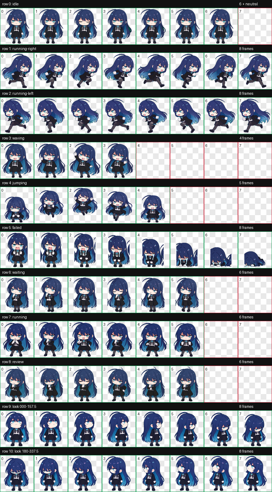
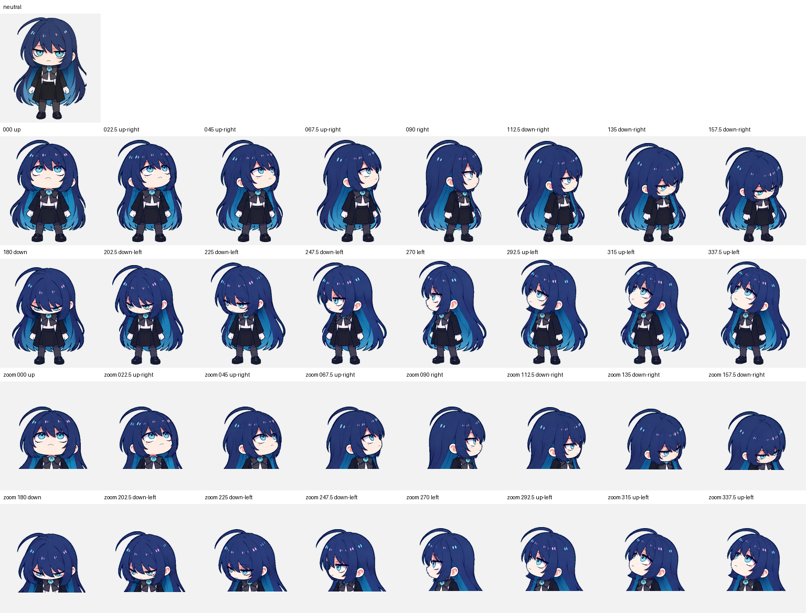

# Ado Chibi Codex Pet

An expressive, dramatic chibi singer pet for the Codex desktop app, with moods ranging from mischievous confidence to frustration, tears, concentration, and celebration.

> [!IMPORTANT]
> This is an unofficial, non-commercial fan project. It is not affiliated with or endorsed by Ado, Ado's representatives, Universal Music Japan, or OpenAI. See [FAN-NOTICE.md](FAN-NOTICE.md).


## Animation previews

| Waving | Waiting | Working |
| --- | --- | --- |
|  |  |  |
| Jumping | Failed | Review |
|  |  |  |
| Moving right | Moving left | Idle |
|  |  |  |

<details>
<summary>Full 8 × 11 contact sheet and look-direction QA</summary>





</details>

## Compatibility

- Codex desktop pet package v2
- `1536 × 2288` transparent WebP atlas
- `8 × 11` grid with `192 × 208` cells
- Nine standard animation rows plus 16 clockwise look directions
- Manifest declares `spriteVersionNumber: 2`

## Install

This repository is private, so clone it with an authenticated GitHub CLI session:

### macOS or Linux

```bash
gh repo clone secemp9/ado-chibi-codex-pet
cd ado-chibi-codex-pet
./install.sh
```

To replace an existing installation, run `./install.sh --force`. The previous installation is moved to a timestamped directory under `$CODEX_HOME/pet-backups`, or `~/.codex/pet-backups` when `CODEX_HOME` is unset.

### Windows PowerShell

```powershell
gh repo clone secemp9/ado-chibi-codex-pet
Set-Location ado-chibi-codex-pet
./install.ps1
```

Use `./install.ps1 -Force` to back up and replace an existing installation.

### Manual installation

Copy these two files together:

```text
pet/ado/pet.json
pet/ado/spritesheet.webp
```

Place them at:

```text
${CODEX_HOME:-$HOME/.codex}/pets/ado/
```

On Windows, use `$env:CODEX_HOME\pets\ado`, or `$HOME\.codex\pets\ado` when `CODEX_HOME` is unset.

After installation, open **Codex → Settings → Pets → Refresh**, then select **Ado**.

## Repository contents

- `pet/ado/` — the two installable runtime files
- `previews/` — all nine animation previews, the full contact sheet, and look-direction sheet
- `qa/` — sanitized validation and direction-review evidence
- `scripts/validate_package.py` — portable package and checksum validator
- `install.sh` and `install.ps1` — local installers with checksum verification and safe replacement backups
- `SHA256SUMS` — hashes for the installable files

Run the same validation used by GitHub Actions:

```bash
python -m pip install Pillow
python scripts/validate_package.py
```

## Release

The `v1.0.0` GitHub release contains an install-only ZIP. Extract its `ado` directory into the Codex `pets` directory, or use one of the repository installers above.

## Rights and reuse

The installer scripts, validation script, and repository documentation are available under the [MIT License](LICENSE). The fan artwork and all third-party names, likenesses, trademarks, and associated character elements are excluded from that license; see [FAN-NOTICE.md](FAN-NOTICE.md).

